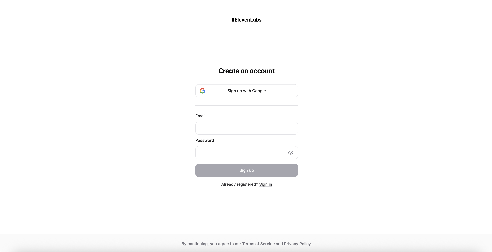
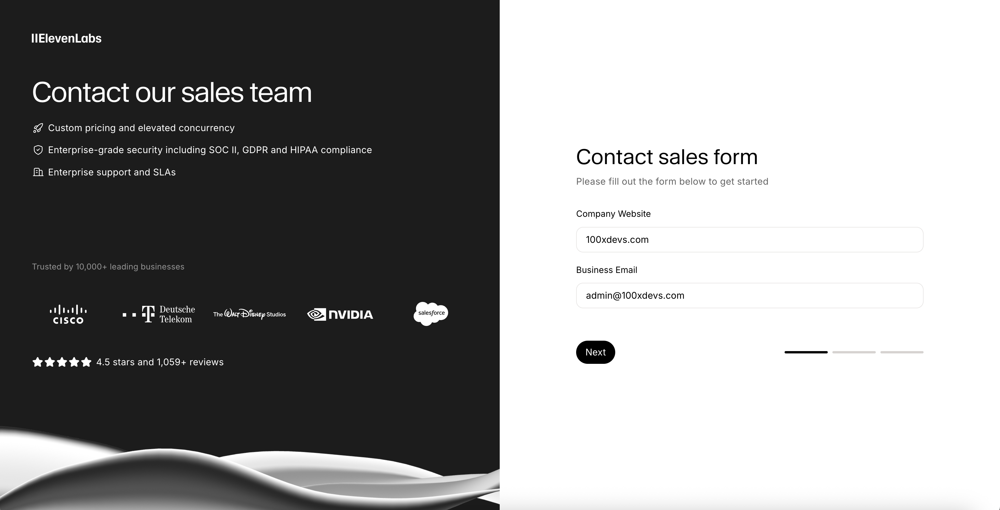

# Clone the given image layout using HTML and CSS.

### Assignment 1 - Age old question — How to center a div

Create a simple webpage that centers a div both vertically and horizontally within the viewport. The div should have a fixed width and height, and it should contain some text content.

### Assignment 2 - Elevenlabs contact-sales form

Link to the form: [Elevenlabs Contact Sales Form](https://elevenlabs.io/contact-sales)

Hardbite : Try to replicate the animaion at the bottom of the form as well.

