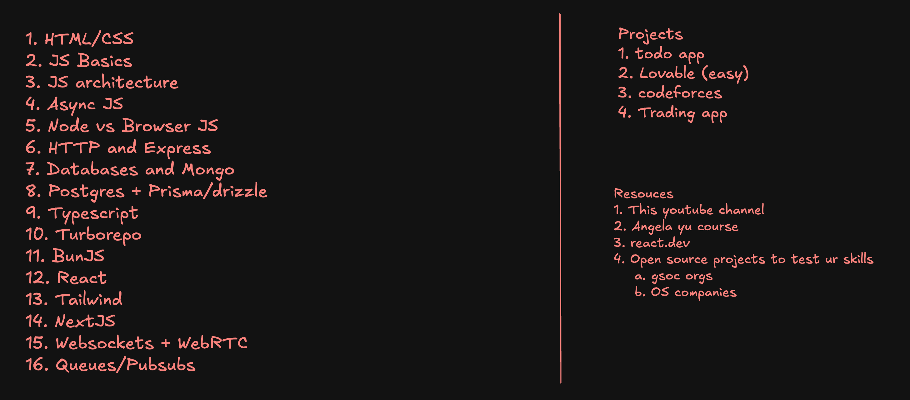
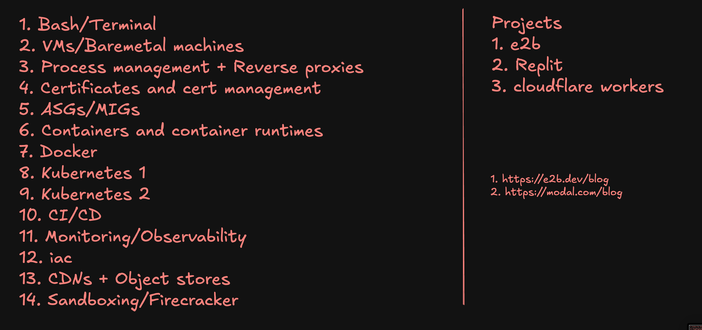
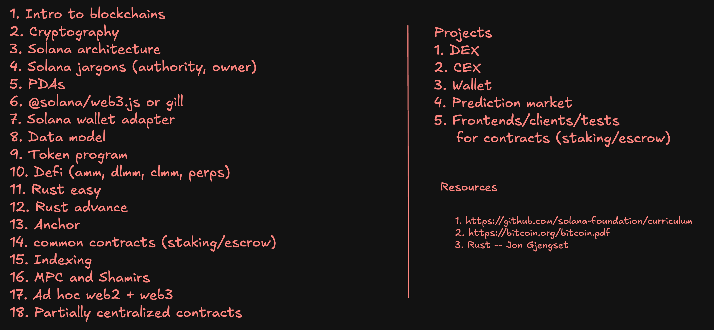
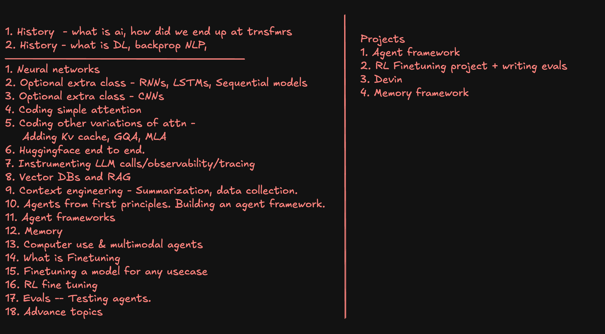

<div align="center">

# 100xSchool Bootcamp 1.0 Notes

### Web Dev & DevOps • Web3 • AI/ML • DSA

[](https://100xdevs.com)
[](https://twitter.com/kirat_tw)

*Comprehensive notes, assignments, and projects from the 100xDevs bootcamp*


---

</div>

## 📌 About

This repository documents my journey through the **100xDevs Cohort 1.0** bootcamp. The course covers modern development practices across Web Development & DevOps, Web3, AI/ML, and Data Structures & Algorithms with hands-on projects and real-world applications.

> **Note:** This is a personal learning repository and is not officially affiliated with 100xDevs. Use it as a supplement to the actual course material.
---

## 📊 Progress Tracker

### 💻 Data Structures & Algorithms Bootcamp

| Week | Module | Topics | Status |
|:----:|--------|--------|:------:|
| Week 01 | Basics | Arrays, Strings, Time Complexity | 📝 |
| Week 02 | Searching & Sorting | Binary Search, Merge Sort, Quick Sort | 📝 |
| Week 03 | Linked Lists | Singly, Doubly, Circular Linked Lists | 📝 |
| Week 04 | Stacks & Queues | Implementation & Applications | 📝 |
| Week 05 | Trees | Binary Trees, BST, Tree Traversals | 📝 |

<div align="right">

[📋 View full DSA syllabus →](./00_dsa/README.md)

</div>

---

### 🌐 Web Development & DevOps Bootcamp

| Week | Module | Topics | Status |
|:----:|--------|--------|:------:|
| Week 01 | Foundations | HTML, CSS, JavaScript Basics | 📝 |
| Week 02 | JavaScript | Advanced JS, DOM Manipulation | 📝 |
| Week 03 | React | Components, Hooks, State Management | 📝 |
| Week 04 | Backend | Node.js, Express, APIs | 📝 |
| Week 05 | Docker | Containerization & Images | 📝 |

<div align="right">

[📋 View full Web Dev & DevOps syllabus →](./01_web-development/README.md)

</div>

---

### 🔗 Web3 Bootcamp

| Week | Module | Topics | Status |
|:----:|--------|--------|:------:|
| Week 01 | Blockchain | Fundamentals & Architecture | 📝 |
| Week 02 | Solana | Wallet, Tokens, Programs | 📝 |
| Week 03 | Smart Contracts | Development & Testing | 📝 |
| Week 04 | DeFi | Protocols & Integration | 📝 |
| Week 05 | dApps | Full-stack Web3 Apps | 📝 |

<div align="right">

[📋 View full Web3 syllabus →](./04_web3/README.md)

</div>

---

### 🤖 AI/ML Bootcamp

| Week | Module | Topics | Status |
|:----:|--------|--------|:------:|
| **Week 00** | **Warmup** | [AI/ML Fundamentals](./03_ai-ml/Week_00_warmup/01_ai_ml_fundamentals.md) | ✅ |
| **Week 00** | **Warmup** | [Introduction to Large Language Models](./03_ai-ml/Week_00_warmup/02_Intro_to_Large_Language_Models.md) | ✅ |
| Week 01 | Neural Networks | Fundamentals & Architectures | ⏳ |
| Week 02 | LLMs | Transformers & Fine-tuning | 📝 |
| Week 03 | AI Agents | Frameworks & Autonomous Systems | 📝 |

<div align="right">

[📋 View full AI/ML syllabus →](./03_ai-ml/README.md)

</div>

---

**Legend:** ✅ Complete • ⏳ In Progress • 📝 Planned

**Last Updated:** January 2024

---

## 📚 Course Syllabus

Click on any track to view the detailed syllabus:

<table>
<tr>
<td width="50%" align="center">

### 🌐 [01_web-development](./syllabus/WEB_DEV.md)


**16 Modules** covering HTML, CSS, JavaScript, React, Node.js, Databases, and Real-time Communication

</td>
<td width="50%" align="center">

### ⚙️ [02_devops](./syllabus/DEVOPS.md)


**14 Modules** including Docker, Kubernetes, CI/CD, Monitoring, and Cloud Infrastructure

</td>
</tr>
<tr>
<td width="50%" align="center">

### 🔗 [04_web3](./syllabus/WEB3.md)


**18 Topics** covering Blockchain, Solana, Smart Contracts, DeFi, and Decentralized Applications

</td>
<td width="50%" align="center">

### 🤖 [03_ai-ml](./syllabus/AI_ML.md)


**18 Modules** from Neural Networks to Agent Frameworks, LLMs, RAG, and Advanced AI Topics

</td>
</tr>
</table>

## 🤝 Contributing

Contributions are welcome! Feel free to:
1. Fork this repository
2. Create your feature branch
3. Submit a pull request

---

## 📝 License

This project is licensed under the MIT License.

---

## 🙏 Acknowledgments

- [Harkirat Singh](https://twitter.com/kirat_tw) for creating the 100xDevs bootcamp
- The 100xDevs community for support and collaboration

---

## 📂 Repository Structure

```
100xSchool_Bootcamp_1.0/
├── 00_dsa/                 # Data Structures & Algorithms
├── 01_web-development/     # Web Development & DevOps bootcamp
├── 02_devops/              # (Merged with Web Development)
├── 03_ai-ml/               # AI/ML bootcamp
│   └── Week_00_warmup/     # ← Currently here
│       ├── 01_ai_ml_fundamentals.md
│       └── 02_Intro_to_Large_Language_Models.md
└── 04_web3/                # Web3 bootcamp
```

---

## 🚀 Quick Start

```bash
# Clone the repository
git clone https://github.com/vishalvoid/100xSchool-Bootcamp-1.0-webdev-devops-web3-ai-notes

# Navigate to the repository
cd 100xSchool-Bootcamp-1.0-webdev-devops-web3-ai-notes

# Explore specific track
cd 03_ai-ml/Week_00_warmup
```

---

<div align="center">

[](https://twitter.com/vishalvoid)
[](https://linkedin.com/in/vishalvoid)
[](mailto:tech.vishalkrsingh@gmail.com)

Made with ❤️ by Vishal Kumar Singh

</div>
